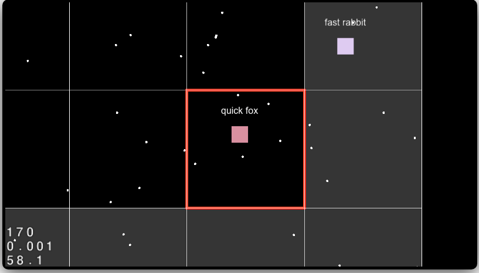

# cocos2Dx-html5 procedurally generated engine with websockets

This is a simple cocos2Dx-html5 demo template with Socket.io

The objective of this template is to provide a websocket engine for 
procedurally generated 2d worlds.



The communication between server and clients is only done using webscockets (no-REST).

## Features

* Supports multiplayer (you can see other players next to you)
* Random name generator for players
* The client will only render the sectors around you, not the whole world.
* When the player discovers a new secotr, the server will populate that sector  (new discovered sectors apperars brighter to the user)
* The currenct sector will appear as red
* Move the player using the keyboard, the camera will follow you.

## How to run (docker)

```
docker-compose up
```

Open your browser in http://localhost:8000

## How to run (without docker)

* Run web game

Simply run this web files on your favourite web server, like: 

```
python -m SimpleHTTPServer 8000
```

* Run websocket server on nodejs

```
cd server
npm install
node app.js
```

## How to "play" 

* Open two different browser windows
* Move your player with your keyboard and see it moving on the other browser

## Next steps

* Persistent world using database like redis
* Draw background using tiles
